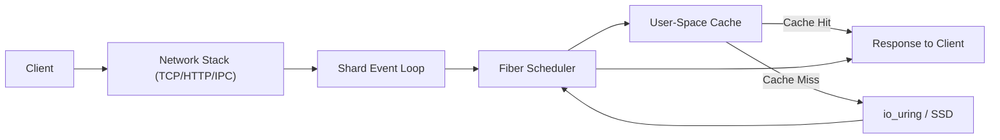
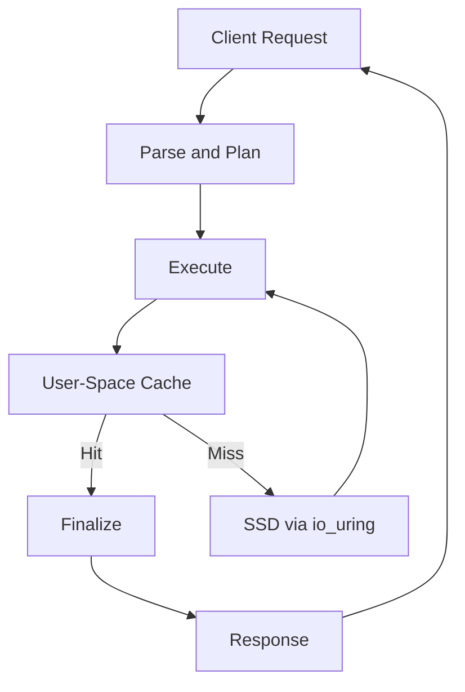
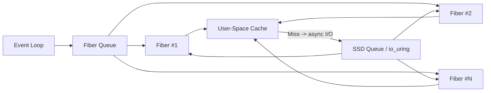

# PlexDB Design

## Overview

Designed for **predictable low-latency and high throughput** on modern superscalar processors and NVMe SSDs. It leverages:

1. **Shard-local ownership:** cores own their data, cache, and I/O.
2. **Non-blocking concurrency:** fibers only yield on async events; cores never block.
3. **User-space caching:** explicit control over memory and eviction for predictable latency.
4. **Asynchronous SSD access:** io_uring submission and completion queues replace blocking reads/writes.
5. **Pipeline-friendly design:** memory layout and fiber scheduling optimized for modern superscalar processors.

---

## 1. Shard Architecture

---

## 2. Request Data Flow

---

## 3. Per-Core Shard + Fiber Scheduler

