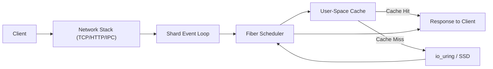
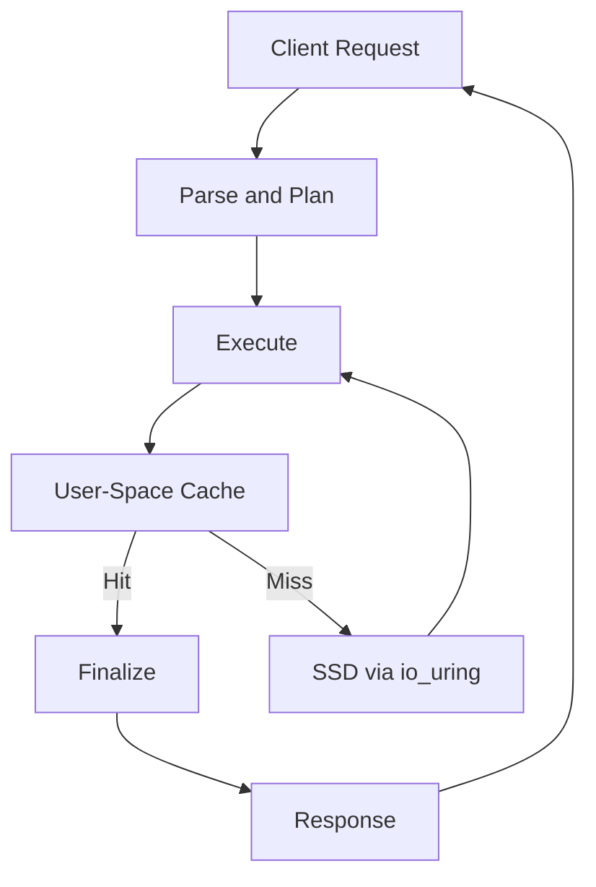
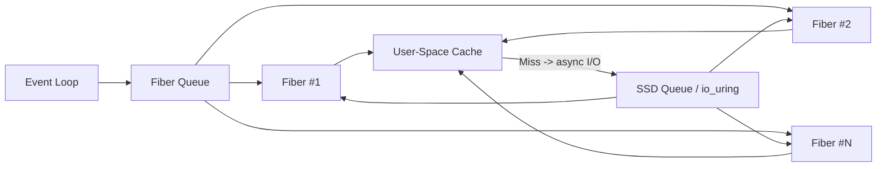

# PlexDB Design

## Overview

Designed for **predictable low-latency and high throughput** on modern superscalar processors and NVMe SSDs. It leverages:

1. **Shard-local ownership:** cores own their data, cache, and I/O.
2. **Non-blocking concurrency:** fibers only yield on async events; cores never block.
3. **User-space caching:** explicit control over memory and eviction for predictable latency.
4. **Asynchronous SSD access:** io_uring submission and completion queues replace blocking reads/writes.
5. **Pipeline-friendly design:** memory layout and fiber scheduling optimized for modern superscalar processors.
6. **Predictable tail latency:** no reliance on kernel page cache for hot or latency-sensitive operations.

The system is optimized for small random reads/writes common in OLTP workloads and supports high fan-in from both network and local IPC clients.

---

## 1. Shard Architecture

**Explanation:**

- **Cache Hit (green path):** Request served from memory → ~0.1–0.5 µs.
- **Cache Miss (red path):** Request hits SSD asynchronously via io_uring → fiber yields while I/O completes.

---

## 2. Request Data Flow

**Explanation:**

- Cache bifurcates hot (memory) vs cold (SSD) paths.
- Fibers allow overlapping I/O with computation, maximizing core utilization.

---

## 3. Per-Core Shard + Fiber Scheduler

**Explanation:**

- Multiple fibers overlap I/O and compute.
- User-space cache reduces SSD accesses for hot data.
- Event loop keeps core fully utilized.

---

## 4. Throughput Considerations

- **Per-core throughput:**
  - Cold pages: 200k–500k req/s (SSD-bound)
  - Hot pages: 1M–2M+ req/s (memory-bound)
- **Input methods:**
  - HTTP adds ~5–50 µs per request
  - IPC adds ~0.1–2 µs per request
- Throughput scales linearly with the number of cores due to shard-local design.
- User-space caching converts hot I/O-bound requests into memory-speed operations.

