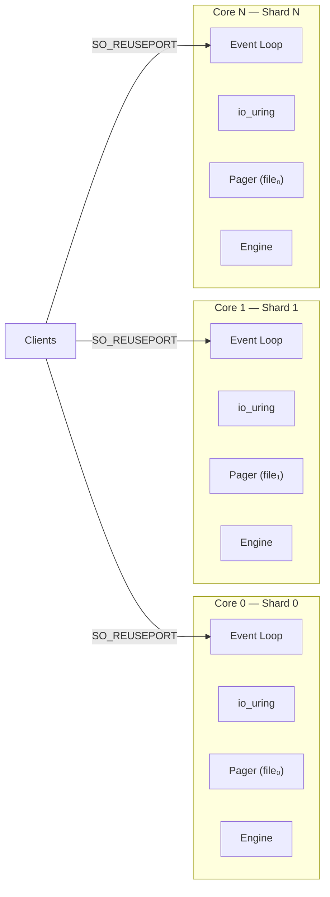
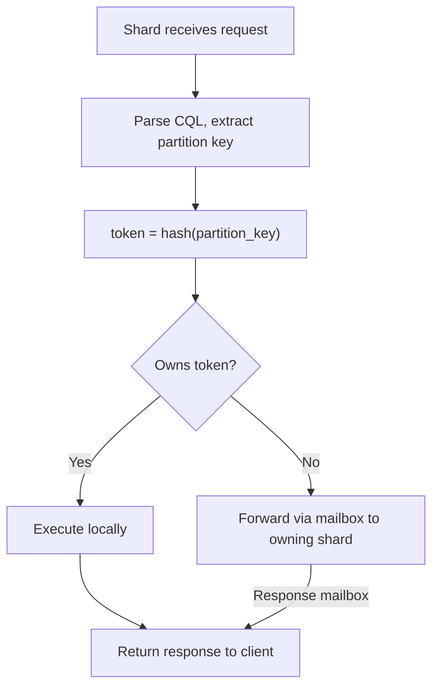
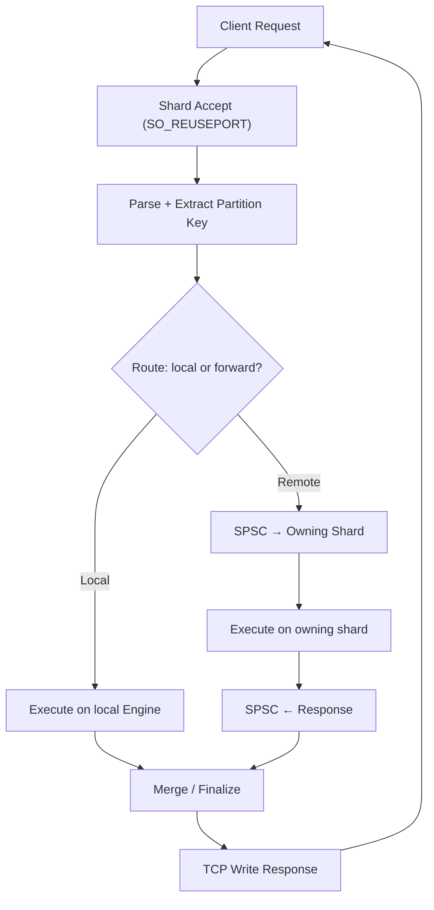
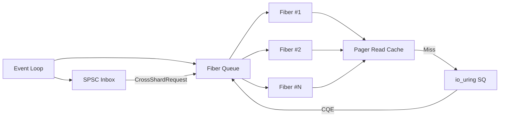

# PlexDB Design

## Overview

Designed for **predictable low-latency and high throughput** on modern superscalar processors and NVMe SSDs. It leverages:

1. **Shard-local ownership:** cores own their data, cache, and I/O — no shared mutable state.
2. **Non-blocking concurrency:** fibers only yield on async events; cores never block.
3. **User-space caching:** explicit control over memory and eviction for predictable latency.
4. **Asynchronous SSD access:** io_uring submission and completion queues replace blocking reads/writes.
5. **Pipeline-friendly design:** memory layout and fiber scheduling optimized for modern superscalar processors.
6. **Layer independence:** the `plexdb` storage library has no knowledge of sharding strategy. All partitioning, routing, and consensus live in higher layers.

---

## Layer Separation

The system is split into three independent layers. Each layer has a clear boundary and communicates through narrow interfaces. The key principle is that **generic sharding primitives live in `plexdb`** while **strategy-specific logic lives in each store**.

```
┌──────────────────────────────────────────────────────────┐
│  Store (objstore, docstore, graphstore, …)               │
│  ┌────────────────────────────────────────────────────┐  │
│  │  Store-Specific Strategy                           │  │
│  │  · Partition key extraction (CQL, doc-id, …)       │  │
│  │  · Request routing / query planning                │  │
│  │  · Schema consensus policy                         │  │
│  │  · Protocol handling (CQL, HTTP, GraphQL, …)       │  │
│  └───────────────┬────────────────────────────────────┘  │
│                  │ one instance per core                  │
│  ┌───────────────▼────────────────────────────────────┐  │
│  │  Shard Instance                                    │  │
│  │  · Own event loop + io_uring ring                  │  │
│  │  · Own TCP accept (SO_REUSEPORT)                   │  │
│  │  · Own Engine / data structures                    │  │
│  │  · Own Pager (file region or dedicated file)       │  │
│  │  · Own ThreadContext + arena                       │  │
│  └───────────────┬────────────────────────────────────┘  │
│                  │ uses                                   │
│  ┌───────────────▼────────────────────────────────────┐  │
│  │  plexdb (core library)                             │  │
│  │  · Pager · BTree · Blob · Arena · OS · Threads     │  │
│  │  · Shard primitives:                               │  │
│  │    · SpscQueue — lock-free SPSC ring buffer        │  │
│  │    · token_of / owning_shard — hash-based mapping  │  │
│  └────────────────────────────────────────────────────┘  │
└──────────────────────────────────────────────────────────┘
```

`plexdb` provides **strategy-independent building blocks**: the SPSC queue handles all inter-shard message passing regardless of message content; `token_of`/`owning_shard` map arbitrary byte keys to shards regardless of what the key represents. Each store provides its own strategy by extracting the appropriate key from its domain (partition key for CQL, document ID for docstore, vertex/edge ID for graphstore) and feeding it to the generic primitives.

This makes `plexdb` reusable across embedded (SQLite-style), single-node multi-core (ScyllaDB-style), and distributed deployments — and across any store type.

---

## 1. Shard-Per-Core Architecture

Each physical core runs exactly one shard. A shard owns:

| Resource | Scope | Notes |
|---|---|---|
| CPU core | pinned via `sched_setaffinity` | avoids cache-line migration |
| io_uring ring | private | one SQ/CQ pair, own buffer pool |
| TCP listener | `SO_REUSEPORT` on same port | kernel distributes connections |
| Pager | dedicated file **or** region within shared file | see *Storage Layout* |
| Engine | private copy of in-memory schema | see *Schema Consensus* |
| Arena / ThreadContext | private | no cross-shard allocation |
| Read cache | private | no coherence protocol needed |
| Write set | private | flushed independently |

Because nothing is shared, there are **zero locks** on the data path.



### Startup Sequence

1. Main thread detects core count via `os::get_system_info()`.
2. For each core *i*, spawn a thread pinned to core *i* (`sched_setaffinity`).
3. Each thread opens (or creates) its shard file / region, constructs its own `Pager`, `Engine`, `ThreadContext`, and `io_uring Ring`.
4. Each thread binds to the same port with `SO_REUSEPORT` and enters its event loop.
5. Main thread waits on a shared `should_exit` flag (signal-driven, same as today).

---

## 2. Data Partitioning

### Token Ring (ScyllaDB-inspired)

Every table has a **partition key** (already represented by `primary_col_idx` in `schema::Table`). The partition key is hashed to a 64-bit **token** using a deterministic hash (e.g. MurmurHash3). The token space `[0, 2^64)` is split into contiguous ranges, one per shard.

```
Token space:  0 ──────────────── 2^64
              |  Shard 0  |  Shard 1  |  ...  |  Shard N  |
```

With *N* shards the boundaries are simply `i * (2^64 / N)` for uniform distribution. A partition with token *t* is owned by shard `t / (2^64 / N)`.

Consistent hashing with virtual nodes is used when shards are added or removed so that only `1/N` of data migrates.

### Token Calculation

```
token(partition_key) = murmur3_64(serialize(partition_key))
owning_shard(token)  = token / (2^64 / shard_count)
```

This runs in the shard that received the client connection. If the receiving shard does not own the token, it forwards the request (see *Request Routing*).

### Storage Layout

Two options, selectable at deploy time:

| Mode | File layout | Pros | Cons |
|---|---|---|---|
| **File-per-shard** | `db_0`, `db_1`, …, `db_N` | Independent I/O, trivial recovery | More file descriptors, harder backup |
| **Region-per-shard** | Single `db` file, each shard owns `[base_offset, base_offset + region_size)` | Simpler ops, single file backup | Requires coordinated resize, `Pager::base_offset` already supports this |

`plexdb::Pager` already accepts a `base_offset` parameter. File-per-shard simply passes `base_offset=0` to separate file handles. Region-per-shard passes different offsets into the same handle. **No changes to `plexdb`** are required in either case.

---

## 3. Request Routing



### Local-only fast path

When a request's partition key hashes to the receiving shard, execution is entirely local: parse → plan → btree lookup → response. No inter-shard communication, no locks.

### Cross-shard forward path

When the partition maps to a different shard, the receiving shard pushes a message onto a **lock-free SPSC queue** (one per shard pair, see §4). The owning shard picks it up in its event loop, executes, and pushes the response back. The original shard completes the client write.

### Scatter-gather (range scans, `SELECT *`)

Requests without a partition key constraint (full table scans) are fanned out to all shards. Each shard returns its local partition of rows. The coordinating shard merges results and responds. This is the slow path — queries should include a partition key whenever possible.

---

## 4. Inter-Shard Communication

### Lock-Free SPSC Mailboxes

Between every ordered pair of shards `(i, j)` there is a **single-producer single-consumer (SPSC) ring buffer**. Shard *i* produces; shard *j* consumes. This gives `N*(N-1)` queues total — acceptable for typical core counts (e.g. 16 cores → 240 queues, each just a few cache lines of metadata each). For machines with more than ~64 cores, a hub-based topology (one coordinator shard that multiplexes messages) should replace the full mesh to keep memory usage linear.

```
Shard 0 ──SPSC──▶ Shard 1
Shard 0 ──SPSC──▶ Shard 2
Shard 1 ──SPSC──▶ Shard 0
Shard 1 ──SPSC──▶ Shard 2
...
```

Each SPSC queue is a power-of-two ring buffer with atomic `head` (written by producer) and `tail` (written by consumer) indices on **separate cache lines** to avoid false sharing. No CAS, no mutex, no memory fence beyond `std::memory_order_release` / `acquire`.

### Message Types

```
CrossShardRequest  { source_shard, request_id, statement, partition_key_bytes }
CrossShardResponse { request_id, execution_result }
SchemaChangeMsg    { raft_term, raft_index, schema_delta }
```

### Polling

Each shard's event loop polls its inbound SPSC queues alongside `io_uring` CQEs. A single `epoll`/`io_uring` iteration handles both network I/O and inter-shard messages:

```
loop:
    drain io_uring CQEs  → handle network events, file I/O completions
    drain SPSC inboxes   → execute forwarded requests, apply schema changes
    submit io_uring SQEs → new reads, writes, accepts
```

---

## 5. Schema Consensus

Schema mutations (`CREATE KEYSPACE`, `CREATE TABLE`, `DROP`, `ALTER`) must be applied consistently across all shards. Since all shards live in the same process and share an address space, a lightweight **Raft** variant is sufficient.

### Raft-Lite (intra-process)

- **Leader election**: the shard on core 0 starts as leader. If it dies, the lowest-numbered live shard takes over. Failure is detected by the absence of periodic heartbeat messages: each shard sends a heartbeat on its outbound SPSC queues at a fixed interval (e.g. 100ms). If a shard's inbound queue from the leader carries no heartbeat for a configurable timeout (e.g. 500ms), it considers the leader dead and initiates election.
- **Log replication**: the leader appends the schema mutation to its log, then pushes `SchemaChangeMsg` to all followers via SPSC queues.
- **Commit**: once a majority acknowledge (via response SPSC), the leader marks the entry committed and applies it locally. Followers apply on receiving the commit notification.
- **Persistence**: the leader writes the committed schema log to a dedicated schema pager page. On recovery, all shards replay the log.

Schema changes are rare relative to data operations. The Raft overhead (a few SPSC messages per DDL) is negligible.

### Why not distributed Raft?

For single-node multi-core, full distributed Raft is overkill. The SPSC-based protocol gives the same linearizable semantics without network round-trips or TCP overhead. If multi-node distribution is added later, the same Raft module can be extended to use TCP between nodes while keeping SPSC within a node.

---

## 6. Deployment Patterns

The design supports four deployment patterns without changing `plexdb`:

### 6.1 Embedded (SQLite-inspired)

Single thread, single pager, no sharding coordinator. This is the **current** mode. Application links `plexdb` and `objstore` directly.

```
Application ─── Engine ─── Pager ─── File
```

### 6.2 Single-Node Multi-Core (ScyllaDB-inspired)

One OS process, one shard per core, `SO_REUSEPORT`, SPSC mailboxes, file-per-shard or region-per-shard. This is the **primary target**.

```
Process
├─ Shard 0: EventLoop ── Engine ── Pager ── db_0
├─ Shard 1: EventLoop ── Engine ── Pager ── db_1
└─ Shard N: EventLoop ── Engine ── Pager ── db_N
     └── SPSC queues between all pairs
```

### 6.3 Multi-Node (PostgreSQL-inspired replication)

Each node runs the single-node multi-core setup. Nodes replicate via Raft over TCP. The shard coordinator on each node participates in a cluster-level Raft group for:
- Schema changes
- Membership / failure detection
- Partition rebalancing

Writes go to the Raft leader; reads can go to any node (with configurable consistency: `ONE`, `QUORUM`, `ALL` inspired by Cassandra consistency levels).

### 6.4 Object Storage Frontend (S3-inspired)

A stateless HTTP gateway maps object keys to partition tokens and routes to the appropriate shard. Large objects are split into chunks stored as blobs across shards (striping). Metadata (bucket listings, ACLs) lives in a dedicated metadata shard group.

```
HTTP Gateway
├─ PUT /bucket/key → hash(key) → Shard → blob::append
├─ GET /bucket/key → hash(key) → Shard → blob::get
└─ LIST /bucket    → scatter to all shards → merge
```

---

## 7. Request Data Flow (updated)



---

## 8. Per-Core Shard + Fiber Scheduler (updated)

Each shard runs a cooperative fiber scheduler inside its event loop. Fibers yield only on io_uring submission (file I/O, network write) or SPSC send (cross-shard forward). There is no preemption and no locking within a shard.



---

## 9. What Changes in Each Layer

### plexdb (generic shard primitives)

| Component | Status |
|---|---|
| `Pager` | Already supports `base_offset`. Each shard gets its own instance. |
| `BTree` / `Blob` | Already take a `Pager*`. No global state. |
| `Arena` / `ThreadContext` | Already per-thread. Each shard thread calls `equip()`. |
| `os::uring` | Already per-instance `Ring`. Each shard creates its own. |
| `shard::SpscQueue` | **New.** Lock-free SPSC ring buffer for inter-shard messaging. Generic over message type. |
| `shard::token_of` / `owning_shard` | **New.** Hash-based token generation and uniform shard assignment. Stores provide key bytes; plexdb maps to shard. |

### Store layer (objstore, docstore, graphstore, …)

Each store provides **strategy-specific** logic on top of plexdb's generic primitives:

| Component | Responsibility |
|---|---|
| Partition key extraction | Extract the appropriate key from the store's domain (CQL partition key, doc ID, vertex ID, …) |
| Request routing | Decide local vs. cross-shard execution using `shard_for_key()` |
| Shard coordinator | Spawn per-core threads, set up SPSC queues between shards, manage lifecycle |
| Schema/metadata consensus | Store-specific Raft-Lite or simpler protocol over SPSC queues |
| Protocol handling | CQL native, HTTP/REST, GraphQL, etc. |

### os layer (small additions needed)

| Component | Change |
|---|---|
| `os::sysinfo` | Expose `sched_setaffinity` / CPU pinning. |
| `os::socket` | Expose `SO_REUSEPORT` option. |

---

## 10. Recovery and Consistency

### Write-Ahead Log (WAL)

Each shard maintains a per-shard WAL. Before modifying btree/blob pages, the shard appends the operation to its WAL. On crash recovery, the WAL is replayed to restore the pager to a consistent state. This is implemented at the `Pager` level and remains shard-unaware — each shard's WAL is independent.

### Consistency Guarantees

| Operation | Guarantee |
|---|---|
| Single-partition read/write | Linearizable (shard-local, no coordination) |
| Cross-partition read (scatter) | Serializable per-shard, eventual across shards |
| Schema change | Linearizable via Raft-Lite |
| Multi-node replication | Tunable: ONE / QUORUM / ALL |

### Failure Handling

- **Shard crash**: other shards detect via SPSC heartbeat timeout. The crashed shard's token range becomes temporarily unavailable (fail-fast). The main thread automatically restarts the shard on the same core — the new shard replays its WAL and re-joins the Raft group. Downtime for the affected token range is bounded by WAL replay time. This is acceptable for single-node deployments; multi-node deployments use replicas to avoid any downtime (see §6.3).
- **Full process crash**: on restart, each shard replays its WAL independently. Schema is recovered from the leader's committed log.
- **Multi-node**: Raft leader election handles node failure. Partition replicas on surviving nodes continue serving reads.

