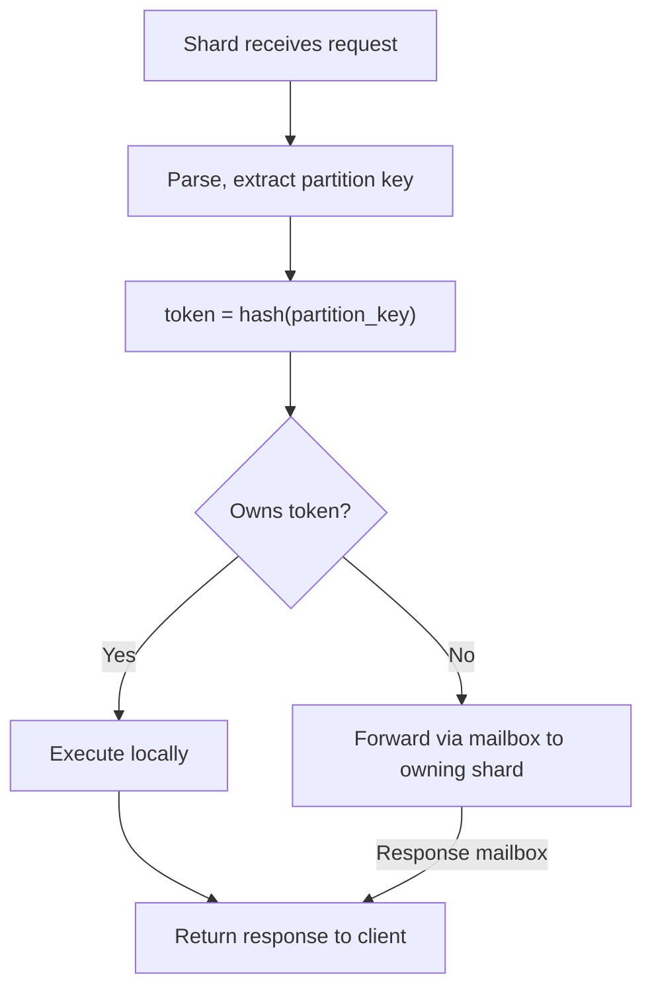

- Parse cache with string hash as key
- Query planning
- Do file io with io_uring
- Avoid storing pager pointer per btree/blob
- Shard across cores
    - OS layer
        - Expose `sched_setaffinity` in `plexdb.os` for CPU pinning
        - Expose `SO_REUSEPORT` in `plexdb.os.socket`
    - Per-store shard coordinator
        - Detect core count, spawn pinned threads
        - Each thread: own `Pager`, `Engine`, `ThreadContext`, `io_uring Ring`
        - `SO_REUSEPORT` TCP listener per shard
        - Event loop: drain CQEs + drain SPSC inboxes + submit SQEs
    - Per-store request routing
        - Extract partition key (store-specific: CQL key, doc ID, vertex ID, …)
        - Hash to token via `plexdb::shard::token_of`
        - Map to shard via `plexdb::shard::owning_shard`
        - Local path: execute on receiving shard
        - Forward path: SPSC push to owning shard, await response
        - Scatter-gather for partition-unbound queries
    - Per-store schema consensus (Raft-Lite)
        - Leader on core 0, heartbeat via SPSC
        - Log replication: leader → all followers via SPSC
        - Commit on majority ack, apply on commit notification
        - Persist committed log to dedicated pager page
    - Abstract SPSC intra process communication, inter process (UDS), network communication 
    - Recovery
        - Schema recovery from leader's committed log

# Dev notes 
- aio proper separation between ownership, caller passes ring/ctx and arena
- Signal cannot interrupt in-progress `aio::drive` startup calls (pager init, engine init) — the signal notifier fd is not registered with `io_poll` until `create_notifier_consumer` is called, so a signal during e.g. a slow WAL recovery queues but does not abort the operation

---

## set-associative cache

The current cache is direct-mapped: `slot = page_idx % read_cache_count`. Two pages whose indices share a slot unconditionally evict each other, even when other slots are free. B-tree access patterns make this worse than random — pages at the same tree level tend to have regularly-spaced indices, causing systematic conflicts on hot paths.

A **k-way set-associative cache** groups slots into sets of k. A page maps to a fixed set (`set = page_idx % (read_cache_count / k)`), and eviction picks a victim from within that set using CLOCK or LRU:

```
set_idx  = page_idx % num_sets          // num_sets = read_cache_count / k
ways     = cache[set_idx * k .. (set_idx+1) * k]

lookup:  scan k ways for matching idx   // k is small (2, 4, 8) — still near O(1)
evict:   CLOCK or LRU within the set
```

**Pros:**
- Eliminates most conflict misses with small k (2-way captures ~80% of full-associativity benefit).
- Minimal structural change — the flat buffer stays; only the index arithmetic and the within-set eviction policy are new.
- No hash table or pointer chasing; cache-friendly sequential scan over k entries.
- Naturally accommodates `in_write_set` tracking: prefer evicting a clean way before a dirty one within the set.

**Cons:**
- Eviction is still local to a set — a globally cold page in a hot set can be evicted while a globally hot page in a cold set sits untouched.
- CLOCK within a set requires a per-set clock hand; LRU requires a small per-set ordering (manageable at k=4, awkward at k=8+).
- Does not help if the working set simply exceeds total cache capacity.

k=4 is a practical starting point: large enough to absorb most conflict misses, small enough that the within-set scan is a single cache line.

---

# Sharding

## Token Ring

Every table has a **partition key** (already represented by `primary_col_idx` in `schema::Table`). The partition key is hashed to a 64-bit **token** using a deterministic hash (xxhash64 via `plexdb::shard::token_of`). The token space `[0, 2^64)` is split into contiguous ranges, one per shard.

```
Token space:  0 ──────────────── 2^64
              |  Shard 0  |  Shard 1  |  ...  |  Shard N  |
```

With *N* shards the boundaries are simply `i * (2^64 / N)` for uniform distribution. A partition with token *t* is owned by shard `t / (2^64 / N)`.

Consistent hashing with virtual nodes is used when shards are added or removed so that only `1/N` of data migrates. Virtual nodes means each physical node `N` is given `V` virtual nodes beginning at a random point in the ring. Adding a node involves adding `V` virtual nodes, moving data from the existing ranges. Similarly for removing a node.

## Token Calculation

```
token(partition_key) = hash(partition_key)
owning_shard(token)  = token / (2^64 / N*V)
```

This runs in the coordinating shard (received the client connection). If the receiving shard does not own the token, it forwards the request.

## Request Routing



### Scatter-gather (range scans, `SELECT *`)

Requests without a partition key constraint (full table scans) are fanned out to all shards. Each shard returns its local partition of rows. The coordinating shard merges results and responds. This is the slow path — queries should include a partition key whenever possible.

## Inter-Shard Communication

### Lock-Free SPSC Mailboxes

Between every ordered pair of shards `(i, j)` there is a **single-producer single-consumer (SPSC) ring buffer**. Shard *i* produces; shard *j* consumes. This gives `N*(N-1)` queues total — acceptable for typical core counts (e.g. 16 cores → 240 queues, each just a few cache lines of metadata each). For machines with more than ~64 cores, a hub-based topology (one coordinator shard that multiplexes messages) may need to replace the full mesh to reduce memory usage.

```
Shard 0 ──SPSC──▶ Shard 1
Shard 0 ──SPSC──▶ Shard 2
Shard 1 ──SPSC──▶ Shard 0
Shard 1 ──SPSC──▶ Shard 2
...
```

Each SPSC queue is a power-of-two ring buffer with atomic `head` (written by producer) and `tail` (written by consumer) indices on **separate cache lines** to avoid false sharing.

### Message Types

```
CrossShardRequest  { source_shard, request_id, statement, partition_key_bytes }
CrossShardResponse { request_id, execution_result }
SchemaChangeMsg    { raft_term, raft_index, schema_delta }
```

### Polling

Each shard's event loop polls its inbound SPSC queues alongside `io_uring` CQEs. A single `epoll`/`io_uring` iteration handles both network I/O and inter-shard messages:

```
loop:
    drain io_uring CQEs  → handle network events, file I/O completions
    drain SPSC inboxes   → execute forwarded requests, apply schema changes
    submit io_uring SQEs → new reads, writes, accepts
```

## Schema Consensus

Schema mutations (`CREATE KEYSPACE`, `CREATE TABLE`, `DROP`, `ALTER`) must be applied consistently across all shards. Assume all shards live in the same process for now.

- **Leader election**: the shard on core 0 starts as leader. If it dies, the lowest-numbered live shard takes over. Failure is detected by the absence of periodic heartbeat messages: each shard sends a heartbeat on its outbound SPSC queues at a fixed interval (e.g. 100ms). If a shard's inbound queue from the leader carries no heartbeat for a configurable timeout (e.g. 500ms), it considers the leader dead and initiates election.
- **Log replication**: the leader appends the schema mutation to its log, then pushes `SchemaChangeMsg` to all followers via SPSC queues.
- **Commit**: once a majority acknowledge (via response SPSC), the leader marks the entry committed and applies it locally. Followers apply on receiving the commit notification.
- **Persistence**: the leader writes the committed schema log to a dedicated schema pager page. On recovery, all shards replay the log.

Schema changes are rare relative to data operations. The Raft overhead (a few SPSC messages per DDL) is negligible.

### Failure Handling

- **Shard crash**: other shards detect via SPSC heartbeat timeout. The crashed shard's token range becomes temporarily unavailable (fail-fast). The main thread automatically restarts the shard on the same core — the new shard replays its WAL and re-joins the Raft group. Downtime for the affected token range is bounded by WAL replay time. This is acceptable for single-node deployments; multi-node deployments use replicas to avoid any downtime (see §6.3).
- **Full process crash**: on restart, each shard replays its WAL independently. Schema is recovered from the leader's committed log.
- **Multi-node**: Raft leader election handles node failure. Partition replicas on surviving nodes continue serving reads.

## Remaining design work
To match cassandra
- Replication
  - Tune replication factor (RF)
  - Per read/write consistency level
    - ONE → talk to 1 replica (fast, possibly stale)
    - QUORUM → majority of replicas (balanced)
    - ALL → all replicas (strongest, slowest)
  - Read repair and Anti-entropy repair (Merkle trees)
  - Hinted handoff
- Compare and set using paxos ([see](https://docs.datastax.com/en/cassandra-oss/3.0/cassandra/dml/dmlLtwtTransactions.html))

Additional features
- Generic Cross partition transactions 
- Global ordering
  - e.g. read-time skew caused by a scatter read not being synchronized with per-shard operations.
